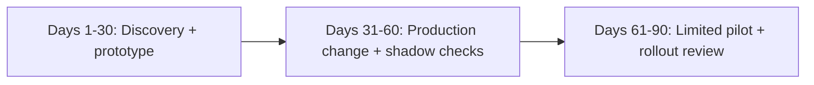
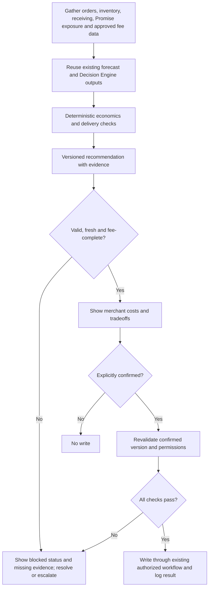

# First 90 days: Inventory Optimization proposal

I propose a first-quarter pilot that helps merchants make better inventory distribution decisions with visible costs. This plan draws on public products and merchant-visible workflows; I would validate internal interfaces, ownership, and baselines with the team.

## Objective

- Merchants need three answers: where stock should live, how much at each location, and when to replenish.
- **Initial placement**, **replenishment**, and **network rebalance** may share a forecast, but have different costs, lead times, constraints, and risks.
- I would reuse ShipBob's existing forecast and Inventory Placement Program (IPP) Decision Engine. Promise provides the delivery-date outcome of placement, routing, and carriers; its integration contract is an early discovery dependency.
- **First-quarter deliverable:** one measurable pilot — a structured recommendation, transparent economics before a decision, explicit confirmation before every write through existing workflows, instrumentation, and a dated rollout-or-stop review.
- I would coordinate with Order Management on Bobby and merchant chat through Model Context Protocol (MCP), using the existing merchant interface and confirming ownership during discovery.

Published context: ShipBob reported about 15% fewer shipping zones and about 16% more in-region fulfillment for IPP merchants during 2025 Black Friday / Cyber Monday. These are context, not this pilot's baseline or causal target ([ShipBob / PR Newswire](https://www.prnewswire.com/news-releases/shipbob-surpasses-1-billion-units-fulfilled-sets-new-black-fridaycyber-monday-records-as-brands-scale-across-channels-302651491.html)).

## Proposed pilot

**Better distribution decisions with visible fees:** I would add transfer and incremental storage costs to Ideal Distribution-style outbound savings before a merchant accepts a move. Success means better merchant net outcomes and informed tradeoffs. Acceptance and override reasons are diagnostics: showing the full cost may appropriately reduce acceptance of uneconomic moves.

I would confirm this priority with the team in the first month, adjusting the scope if instrumentation, case-pack validation, or receiving visibility offers greater merchant value.

## Ninety-day plan

### Days 1–30 — Understand the domain and build a prototype

**Deliverable:** a working prototype and one-page specification covering the cohort, economics, recommendation states, comparison design, and stop rules. I would:

- Map the existing WRO (Warehouse Receiving Order), ITO (Internal Transfer Order), distribution, forecast, and Promise interfaces with their owners; document unresolved dependencies.
- Work with Merchant Success to understand override reasons and establish measured baselines.
- Resolve pricing dependencies: which approved source provides merchant-specific transfer rates, storage rates and billing rules, exemptions, and who pays? Who owns each source, how fresh must it be, and how will estimates reconcile to billed charges?
- Agree on the cost and forecast horizons, forecast granularity, demand uncertainty, transfer/receiving lead times, peak freeze, and delivery-service guardrails.
- Demonstrate a read-only comparison of current and proposed inventory distribution, or a shadow evaluation, reusing existing recommendations and keeping every numerical calculation outside the language model.

### Days 31–60 — Ship instrumentation and validate in shadow

**Deliverable:** one merged pull request, a validated recommendation object, and correctness results on the agreed cohort. Shadow evaluation checks recommendations without showing them to merchants or executing them; it cannot measure acceptance. I would:

- Validate case-pack multiples, unit conservation, destination eligibility including Not Accepting Inventory, stock availability, and merchant scope deterministically.
- Check fee provenance, freshness, formula accuracy, and plan changes against approved source records and existing workflows.
- Instrument `shown`, `accepted`, `overridden(reason)`, `expired`, write results, actual fees, and affected inventory outcomes. Mark experimental assignment and actual merchant exposure separately.
- Require explicit confirmation before any write through existing WRO / ITO paths. Block invalid or stale proposals; there are no unattended ITOs in this pilot.

### Days 61–90 — Run a limited pilot and decide whether to expand

**Deliverable:** a documented decision to expand, redesign, or stop, with evidence limits and a follow-up date for outcomes still pending. I would:

- Show recommendations to merchants only after shadow correctness and safety gates pass; retain confirmation on every write.
- Review early decision quality and safety seven days after exposure, and available economics at thirty days after exposure. Both reviews start from merchant exposure.
- Expand only with credible merchant benefit and intact service guardrails. Lower acceptance alone is not a failure; inspect which proposals merchants decline and why.
- Allow transfer, receiving/stowing, and demand time before judging physical outcomes. If evidence is immature at the quarter-end review, hold expansion and schedule a follow-up review.

## Cohort and comparison (illustrative)

I would start with 10–20 consenting US merchants eligible for distribution recommendations, using established stock-keeping units (SKUs) with enough demand history and valid destination capacity. The initial cohort would exclude launches, exceptional promotions, and peak-freeze moves. Feasibility and sample size would determine whether an effect estimate is credible.

I would use the preceding four comparable weeks to describe merchant/SKU mix, decision behavior, actual costs, stockouts, and service performance, accounting for promotions and seasonality. Where feasible, I would randomize at merchant level between the existing approved decision flow and the fee-visible flow, balancing volume and network footprint. The analysis would include all assigned merchants and all eligible proposals, including suppressed or blocked proposals, to avoid selecting only accepted moves. If randomization is infeasible, I would use matched contemporaneous merchants plus the pre-period and label findings observational.

Exposure starts when a merchant first sees a fee-visible recommendation, or the equivalent recommendation in the comparison group. Observation windows would be aligned, with exposure counts reported. A small pilot can establish feasibility and safety without establishing causal savings.

## Recommendation object (product contract)

| Field | Purpose |
| --- | --- |
| Identity / scope | Recommendation ID/version, merchant, SKU/inventory ID, experiment assignment and timestamps |
| Source / destination FC | Fulfillment centers; source null for a next-WRO split or reorder |
| Quantity / action | Integer and applicable case-pack multiple; `ITO`, `next_WRO_split`, or `reorder` |
| Economics | Expected outbound savings less transfer fees and incremental storage costs over one stated horizon; amounts/ranges, assumptions and exclusions |
| Fee evidence | Approved source, rate version, merchant applicability, owner, retrieved time and validity for each fee; `known`, `banded`, or `unknown` |
| Delivery / zone effect | Expected delivery-date or zone change and uncertainty, grounded in existing services |
| Evidence | Existing forecast/version, velocity, Ideal vs Current, days on hand, WRO expected/stowed |
| Policy | `confirm_required`, `blocked`, or `escalate`; escalation never bypasses confirmation or validation |
| Decision / audit | Accepted or overridden with reason capture; no response separately; confirmed version, actor, time and write result |

**States:** `proposed` → `shown` → `accepted` → `confirmed` → `written` → `executed` → `measured`. A proposal may instead be `blocked`, `overridden`, or `expired`; those states cannot write. `written` means the existing workflow accepted the request, not that stock has moved. The workflow records write failures separately and prevents duplicate writes.

Immediately before a write, the workflow revalidates scope, permissions, quantities, destination, freshness, and the explicitly confirmed proposal version. Material changes require a new confirmation. A batch may be presented for review, but each included action must be explicitly covered by confirmation and pass the same checks.

**Fee-complete** means all applicable transfer and storage charges are covered by approved, current, merchant-specific values or validated bounded estimates, with a defensible outbound-savings estimate over the same horizon. A zero charge requires evidence of the applicable exemption. Unknown or stale fees remain visibly unknown, do not count as fee-complete, and block execution of that pilot proposal until resolved. Cards with missing costs make no net-savings claim; estimates display uncertainty ranges.

## Proposed workflow

The proposed workflow gathers merchant-scoped inputs in parallel and evaluates them in sequence. Existing services and deterministic calculators produce all numerical results; a language model may explain them.

**MCP and write permissions:** Inventory MCP is read-only. Receiving MCP can create/cancel WROs when the account role permits. MCP has no ITO creation tool; transfers use existing dashboard/normal transfer workflows after confirmation. A readable `internal_transfer` quantity is in-transit stock, not a transfer-write API. I would validate the integration and permissions with the owning team before implementation.

## Illustrative merchant decision

SKU-1044 sells primarily on the East Coast; 200 units sit in Texas. All numbers below are examples, not ShipBob rates or baselines.

| Line | Value over a four-week horizon |
| --- | --- |
| Proposed move | 120 units TX → NJ |
| Transfer fee | $0.40 × 120 = $48 |
| Incremental NJ storage | $0.10 × 120 units × 4 weeks = $48 (simplified full-horizon assumption) |
| Expected outbound savings | $0.90 × 80 orders = $72 |
| Net savings | $72 − $48 − $48 = **−$24: $24 extra cost** |

Actual storage must reflect inventory drawdown and billing rules. This move does not save money on these assumptions. A delivery improvement is a separate, uncertain benefit; a merchant may knowingly pay for it, but the card must show the cost and record that tradeoff. Rejecting the move can be the better decision.

## Pilot checks and stop rules (illustrative)

These are proposed pilot gates, not company baselines. I would agree on a calendar review date and minimum exposure/sample requirements before launch.

| Check | Prelaunch validation and first seven days after exposure | Thirty days after exposure and mature follow-up |
| --- | --- | --- |
| Safety and correctness | 100% of writes explicitly confirmed and validated; any unauthorized, duplicate, or invalid write pauses rollout immediately | Retain the same gate; investigate and resolve failures before resuming |
| Fee transparency | 100% of shown cards label fee status; 100% of written proposals fee-complete; unknowns never called savings | Reconcile estimates with billed costs where available; material misstatements pause rollout for correction |
| Feasibility | Illustrative ≥80% of eligible proposals fee-complete; below this, hold expansion and repair pricing coverage | Reassess coverage across the full eligible denominator, including blocked proposals |
| Decision quality | Inspect reasons and comprehension; acceptance of shown cards reported by economics band, with no acceptance floor | Compare choices and tradeoffs with the comparison flow; declining a costly move may be desirable |
| Merchant outcomes | Establish cost/service baselines and tracking; no claim of physical savings yet | Estimate incremental merchant net benefit and service/stockout effects across the assigned cohort, with uncertainty; expand only with adequate evidence of benefit and no material service harm |

Existing forecast diagnostics would help explain recommendation errors. I would agree on a service-harm tolerance and minimum worthwhile benefit with the team before exposure. Costs and service effects are tracked from the decision onward. Assessing physical outcomes also requires transfer completion, stowing, and an agreed demand horizon; late moves may need more than thirty days. Pending outcomes remain explicitly reported.

## Sources and evidence limits

- BFCM 2025 IPP context: [ShipBob / PR Newswire, 2026-01-05](https://www.prnewswire.com/news-releases/shipbob-surpasses-1-billion-units-fulfilled-sets-new-black-fridaycyber-monday-records-as-brands-scale-across-channels-302651491.html).
- IPP AI/ML Decision Engine: [ShipBob / PR Newswire, 2024-10-08](https://www.prnewswire.com/news-releases/shipbob-announces-aiml-driven-inventory-placement-program-for-automated-distribution-and-replenishment-is-now-available-to-all-merchants-in-the-us-302269567.html).
- Ideal Distribution fee caveat: observed merchant Inventory Distribution UI copy excludes storage costs and transfer fees. Applicability to the selected merchant cohort remains a discovery question.
- MCP boundaries: tool capabilities observed on September 16, 2026. Availability and role permissions require validation before implementation.
- Delivery expectations: Senior AI Product Builder, Inventory Optimization role description. Team ownership and implementation interfaces remain discovery dependencies.

Cohort sizes, gates, prices, and timing assumptions are illustrative and subject to validation with ShipBob.
