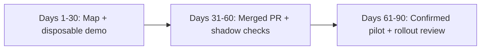
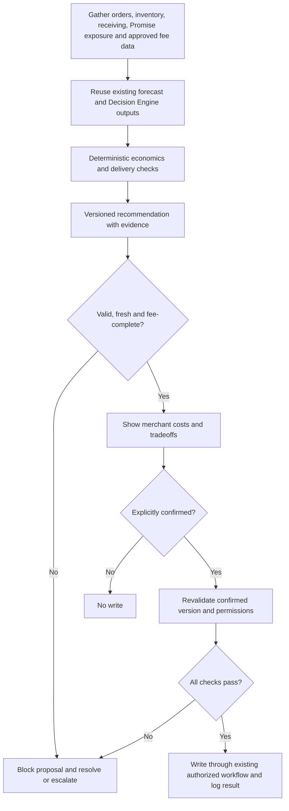

# First 90 days: Inventory Optimization deliverable

**Audience:** hiring manager (Ivan Kanev) — a proposed first-quarter deliverable, grounded in public products and merchant-visible workflows. Internal architecture, ownership, and baselines require discovery.

## Thesis

- Merchants need three answers: where stock should live, how much at each location, and when to replenish.
- **Initial placement**, **replenishment**, and **network rebalance** may share a forecast, but have different costs, lead times, constraints, and risks.
- Reuse ShipBob's existing forecast and Inventory Placement Program (IPP) Decision Engine. Treat Promise as a delivery-date outcome of placement, routing, and carriers; confirm the integration contract without inventing weights or rebuilding either system.
- **First-quarter deliverable:** one measurable bet — a typed recommendation object, transparent economics before a decision, explicit confirmation before every write through existing workflows, instrumentation, and a dated rollout-or-stop review.
- Bobby and merchant MCP chat belong to the separate Order Management surface. Coordinate with that team.

Public peak signal: ShipBob reported about 15% fewer shipping zones and about 16% more in-region fulfillment for IPP merchants during 2025 Black Friday / Cyber Monday. These are context, not this pilot's baseline or causal target ([ShipBob / PR Newswire](https://www.prnewswire.com/news-releases/shipbob-surpasses-1-billion-units-fulfilled-sets-new-black-fridaycyber-monday-records-as-brands-scale-across-channels-302651491.html)).

## The bet (default)

**Better distribution decisions with visible fees:** add transfer and incremental storage costs to Ideal Distribution-style outbound savings before a merchant accepts a move. Prioritize merchant net outcomes and informed tradeoffs. Acceptance and override reasons are diagnostics: showing the full cost may appropriately reduce acceptance of uneconomic moves.

Ask Ivan whether the pod prefers another first change, such as instrumentation, case-pack validation, or receiving visibility. Change the bet while preserving the delivery shape below.

## Ninety-day plan

### Days 1–30 — Map the domain and prove the contract

**Exit:** a working disposable demo and one-page contract covering the cohort, economics, states, comparison, and stop rules.

- Map the existing WRO (Warehouse Receiving Order), ITO (Internal Transfer Order), distribution, forecast, and Promise interfaces with their owners; label unverified details unknown.
- Shadow merchant success; collect override reasons and available baselines rather than inventing them.
- Resolve pricing dependencies: which approved source provides merchant-specific transfer rates, storage rates and billing rules, exemptions, and who pays? Who owns each source, how fresh must it be, and how will estimates reconcile to billed charges?
- Agree on the economics horizon, forecast grain, demand uncertainty, transfer/receiving lead times, peak freeze, and delivery-service guardrails.
- Demo a read-only inventory/plan diff or shadow evaluation harness, reusing existing recommendations and keeping every numerical calculation outside the LLM.

### Days 31–60 — Merge instrumentation and run in shadow

**Exit:** one merged pull request, a validated recommendation object, and shadow correctness results on the agreed cohort. Shadow does not measure merchant acceptance of unseen recommendations.

- Validate case-pack multiples, unit conservation, destination eligibility including Not Accepting Inventory, stock availability, and merchant scope deterministically.
- Check fee provenance, freshness, formula accuracy, and plan diffs against approved source records and existing workflows.
- Instrument `shown`, `accepted`, `overridden(reason)`, `expired`, write results, actual fees, and affected inventory outcomes. Mark experimental assignment and actual merchant exposure separately.
- Wire explicit confirmation before any write through existing WRO / ITO paths. Block invalid or stale proposals; there are no unattended ITOs in this pilot.

### Days 61–90 — Run a limited pilot and make a dated decision

**Exit:** a documented expand, redesign, or stop decision, with evidence limits and a follow-up date for outcomes that have not matured.

- Begin merchant-visible exposure only after shadow correctness and safety gates pass; retain confirmation on every write.
- Review early decision quality and safety seven days after exposure, and available economics at thirty days after exposure. These are experiment clocks, not employment days 7 and 30.
- Expand only with credible merchant benefit and intact service guardrails. Lower acceptance alone is not a failure; inspect which proposals merchants decline and why.
- Allow transfer, receiving/stowing, and demand time before judging physical outcomes. If evidence is immature at the quarter-end review, hold expansion and schedule the later outcome readout.

## Cohort and comparison (illustrative; agree with the pod)

Start with 10–20 consenting US merchants eligible for distribution recommendations, using established SKUs with enough demand history and valid destination capacity. Exclude launches, exceptional promotions, and peak-freeze moves initially. Confirm feasibility and sample size before promising an effect estimate.

Use the preceding four comparable weeks to describe merchant/SKU mix, decision behavior, actual costs, stockouts, and service performance; account for promotions and seasonality. If feasible, randomize at merchant level between the existing approved decision flow and the fee-visible flow, balancing volume and network footprint. Track all assigned merchants and all eligible proposals, including suppressed or blocked proposals; do not compare only accepted moves. If a randomized comparison is infeasible, use matched contemporaneous merchants plus the pre-period and label findings observational.

For the treatment, exposure starts when the merchant first sees a fee-visible recommendation; record the equivalent first shown recommendation in the comparison group. Use aligned observation windows and report exposure counts. A small pilot can establish feasibility and safety without establishing causal savings.

## Recommendation object (product contract)

| Field | Purpose |
| --- | --- |
| Identity / scope | Recommendation ID/version, merchant, SKU/inventory ID, experiment assignment and timestamps |
| Source / destination FC | Fulfillment centers; source null for a next-WRO split or reorder |
| Quantity / vehicle | Integer and applicable case-pack multiple; `ITO`, `next_WRO_split`, or `reorder` |
| Economics | Expected outbound savings less transfer fees and incremental storage costs over one stated horizon; amounts/ranges, assumptions and exclusions |
| Fee evidence | Approved source, rate version, merchant applicability, owner, retrieved time and validity for each fee; `known`, `banded`, or `unknown` |
| Delivery / zone effect | Expected delivery-date or zone change and uncertainty, grounded in existing services |
| Evidence | Existing forecast/version, velocity, Ideal vs Current, days on hand, WRO expected/stowed |
| Policy | `confirm_required`, `blocked`, or `escalate`; escalation never bypasses confirmation or validation |
| Decision / audit | Accepted or overridden with reason capture; no response separately; confirmed version, actor, time and write result |

**States:** `proposed` → `shown` → `accepted` → `confirmed` → `written` → `executed` → `measured`. A proposal may instead be `blocked`, `overridden`, or `expired`; those states cannot write. `written` means the existing workflow accepted the request, not that stock has moved. Record write failures separately and prevent duplicate writes.

Immediately before a write, revalidate scope, permissions, quantities, destination, freshness, and the explicitly confirmed proposal version. Material changes require a new confirmation. A batch may be presented for review, but each included action must be explicitly covered by confirmation and pass the same checks.

**Fee-complete** means all applicable transfer and storage charges are covered by approved, current, merchant-specific values or validated bounded estimates, with a defensible outbound-savings estimate over the same horizon. A zero charge requires evidence of the applicable exemption. Unknown or stale fees remain visibly unknown, do not count as fee-complete, and block execution of that pilot proposal until resolved. Do not display a net-savings claim with missing costs; show uncertainty ranges for estimates.

## System shape of the bet (proposal, not private architecture)

One lead orchestrates; gather merchant-scoped inputs in parallel and decide in sequence. Existing services and deterministic calculators own all numbers; an LLM may explain their results.

**MCP / write-path boundaries:** Inventory MCP is read-only. Receiving MCP can create/cancel WROs when the account role permits. MCP has no ITO creation tool; transfers use existing dashboard/normal transfer workflows after confirmation. A readable `internal_transfer` quantity is in-transit stock, not a transfer-write API. Confirm the integration with the owning team before implementation.

## Worked quantity (illustrative)

SKU-1044 sells mostly East Coast; 200 units sit in Texas. All numbers below are examples, not ShipBob rates or baselines.

| Line | Value over a four-week horizon |
| --- | --- |
| Proposed move | 120 units TX → NJ |
| Transfer fee | $0.40 × 120 = $48 |
| Incremental NJ storage | $0.10 × 120 units × 4 weeks = $48 (simplified full-horizon assumption) |
| Expected outbound savings | $0.90 × 80 orders = $72 |
| Net savings | $72 − $48 − $48 = **−$24: $24 extra cost** |

Actual storage must reflect inventory drawdown and billing rules. This move does not save money on these assumptions. A delivery improvement is a separate, uncertain benefit; a merchant may knowingly pay for it, but the card must show the cost and record that tradeoff. Rejecting the move can be the better decision.

## Pilot checks and stop rules (illustrative; agree before exposure)

These are proposed pilot gates, not company baselines. Set a calendar review date and minimum exposure/sample requirements before launch.

| Check | Shadow / first seven days after exposure | Thirty days after exposure and mature follow-up |
| --- | --- | --- |
| Safety and correctness | 100% of writes explicitly confirmed and validated; any unauthorized, duplicate, or invalid write pauses rollout immediately | Retain the same gate; investigate and resolve failures before resuming |
| Fee honesty | 100% of shown cards label fee status; 100% of written proposals fee-complete; unknowns never called savings | Reconcile estimates with billed costs where available; material misstatements pause rollout for correction |
| Feasibility | Illustrative ≥80% of eligible proposals fee-complete; below this, hold expansion and repair pricing coverage | Reassess coverage across the full eligible denominator, including blocked proposals |
| Decision quality | Inspect reasons and comprehension; acceptance of shown cards reported by economics band, with no acceptance floor | Compare choices and tradeoffs with the comparison flow; declining a costly move may be desirable |
| Merchant outcomes | Establish cost/service baselines and tracking; no claim of physical savings yet | Estimate incremental merchant net benefit and service/stockout effects across the assigned cohort, with uncertainty; expand only with adequate evidence of benefit and no material service harm |

Use existing forecast diagnostics to explain recommendation errors; do not turn this fee-visibility pilot into a new forecast-model competition. Define a service-harm tolerance and minimum worthwhile benefit with the pod before exposure. For physical outcomes, record transfer completion/stowing and observe an agreed demand horizon afterward; late moves may need more than thirty days. Report pending outcomes rather than treating them as zero cost or success.

## What a good early pull request looks like

Instrumentation, recommendation-object scaffolding, deterministic validation, fee provenance and visible uncertainty, and confirmation wiring into an existing workflow. The quarter delivers a reviewable product change and a decision backed by evidence. It does not introduce unattended inventory writes, a replacement optimizer, or a second Bobby.

## Sources and evidence limits

- BFCM 2025 IPP context: [ShipBob / PR Newswire, 2026-01-05](https://www.prnewswire.com/news-releases/shipbob-surpasses-1-billion-units-fulfilled-sets-new-black-fridaycyber-monday-records-as-brands-scale-across-channels-302651491.html).
- IPP AI/ML Decision Engine: [ShipBob / PR Newswire, 2024-10-08](https://www.prnewswire.com/news-releases/shipbob-announces-aiml-driven-inventory-placement-program-for-automated-distribution-and-replenishment-is-now-available-to-all-merchants-in-the-us-302269567.html).
- Ideal Distribution fee caveat: merchant Inventory Distribution UI observed during interview prep; savings copy excludes storage costs and transfer fees. Confirm current scope with the pod.
- MCP boundaries: ShipBob public developer materials and connector survey recorded in interview prep, 2026-09-16; revalidate tools and role permissions before implementation.
- Role expectations and ownership framing: Senior AI Product Builder, Inventory Optimization job description and sibling Order Management role materials reviewed during interview prep.

This is an interview proposal; cohort sizes, gates, prices, and timing assumptions require validation with ShipBob.
