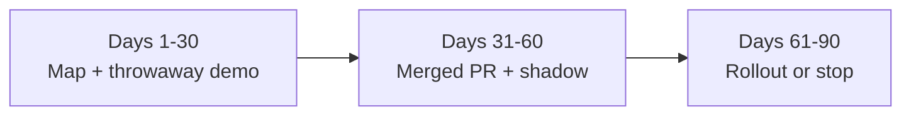
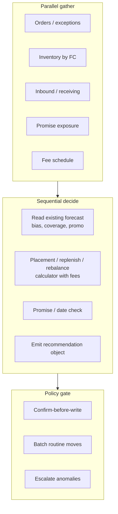

# First 90 days: Inventory Optimization deliverable

**Audience:** hiring manager (Ivan Kanev) — what I would ship in the first quarter, not a target-state platform diagram.

## Thesis

- Merchants still need three answers: where stock should live, how much at each location, and when to replenish.
- Those map to three different decisions: **initial placement**, **replenishment**, and **network rebalance**. They may share a forecast, but costs, lead times, constraints, and risk differ.
- ShipBob already ships an Inventory Placement Program (IPP) with an AI/ML Decision Engine, plus Promise for checkout delivery dates. Treat Promise as the date outcome of placement, routing, and carriers. Do not rebuild either in quarter one.
- **First 90 days deliverable:** one thin, measurable bet — a typed recommendation object, fee-complete economics before ask-to-accept, confirm-before-write into existing Warehouse Receiving Order (WRO) / Internal Transfer Order (ITO) paths, instrumentation, and a calendar date for rollout-or-stop.
- Bobby (dashboard chat) and Model Context Protocol (MCP) merchant chat sit with Order Management. Coordinate; do not fork a second action layer.

Public peak signal (IPP merchants, 2025 Black Friday / Cyber Monday): about 15% fewer shipping zones and about 16% more in-region fulfillment ([ShipBob / PR Newswire, 2026-01-05](https://www.prnewswire.com/news-releases/shipbob-surpasses-1-billion-units-fulfilled-sets-new-black-fridaycyber-monday-records-as-brands-scale-across-channels-302651491.html)).

## The bet (default)

**Fee-complete distribution acceptance:** when Ideal Distribution-style savings copy excludes storage and transfer fees (merchant Inventory Distribution UI), put those fees back into the recommendation the merchant sees before they accept a move. Measure whether acceptance and fee honesty improve on a defined cohort.

Ask Ivan on day one if the pod already prefers a different first pull request (instrumentation-only, case-pack validation, receiving honesty). Change the bet; keep the same delivery shape below.

## Ninety-day plan

### Days 1–30 — Map domain + throwaway prototype

**Exit:** Working disposable demo + one-page contract (fields, states, stop numbers) shown to the pod. Not slides-only.

- Read Inventory Optimization surfaces enough to name WRO / ITO / distribution models you can see; label the rest unknown.
- Shadow merchant success on IPP override reasons; ask for acceptance baselines (not public).
- Clarify Inventory Optimization ↔ Promise availability contract; who pays ITO cost; forecast grain/horizon (point vs probabilistic).
- Pick one bet (default above).

**Prototype demos (pick one; sandbox / shadow only):**

1. MCP read of inventory + Ideal-style plan diff (no inventory writes via MCP).
2. Shadow recommender that logs Ideal-vs-Current diffs and proposed ITO / next-WRO splits with fee fields and case-pack checks.
3. Evaluation harness: score shadow plans vs seasonal-naive geography / merchant overrides; print a day-7 stop card.

### Days 31–60 — Ship instrumentation + recommendation object

**Exit:** Shadow on a defined cohort; acceptance logs; one merged pull request; day-7 / day-30 stop criteria visible in the spec.

- Instrument `shown` / `accepted` / `overridden(reason)` / downstream in-region or zone on affected stock-keeping units (SKUs).
- Land recommendation-object scaffolding (schema validation: case-pack multiples, unit conservation, Not Accepting Inventory).
- Confirm-before-write into merchant WRO / ITO workflows. No auto ITO at scale. Respect peak freeze once known.
- Deterministic gates stay outside the model: Ideal eligibility, fee caveats, Fast-Track labels where eligible.

### Days 61–90 — Rollout or stop

**Exit:** Documented rollout-or-stop with numbers; clearer Inventory Optimization vs Promise vs Merchant Tech boundaries; next bet queued with stop thresholds drafted.

- Compare shadow to merchant actions; limited rollout with confirm-before-write.
- Hold the stop review on the calendar date written in the spec. Day-7 misses practiced from shadow reads. If floors miss, stop auto paths; redesign economics or stop — do not only retune model weights.
- Distinguish metrics observable in seven days from outcomes whose causal window is longer (transfers, receiving, weeks of demand).

## Recommendation object (product contract)

| Field | Purpose |
| --- | --- |
| SKU / inventory id | Item identity |
| Source / destination fulfillment center (FC) | Origin and target (source null for next-WRO split or reorder) |
| Quantity | Integer; case-pack multiple when Case Picks is on |
| Vehicle | `ITO` \| `next_WRO_split` \| `reorder` |
| Cost deltas | Transfer fee, storage change, expected outbound savings (with confidence: known / banded / unknown) |
| Promise / zone deltas | Expected transit or zone change on that proposal |
| Evidence | Velocity, Ideal vs Current, days on hand (DOH), WRO expected/stowed |
| Policy | `auto` / `batch` / `escalate` |
| Override reason | Required when merchant overrides |

**States:** `proposed` → `shown` → `accepted` \| `overridden` \| `expired` → `written` → `executed` → `measured`

Confirm-before-write sits on the transition into `written`.

## System shape of the bet (not a new platform)

One lead orchestrates. Gather merchant-scoped inputs in parallel; decide in sequence; keep calculators deterministic. No peer-to-peer agent mesh.

**MCP / write-path facts (do not invent private stack):**

- MCP **Inventory** is read-only (nine tools).
- MCP **Receiving** can create and cancel WROs when the account role allows.
- MCP has **no** ITO / transfer create tools. Cross-FC moves stay on the dashboard / normal transfer paths. A readable `internal_transfer` quantity is stock-in-transit state, not a create-transfer API.

## Worked quantity (illustrative)

SKU-1044 sells mostly East Coast; 200 units sit in Texas.

| Line | Value |
| --- | --- |
| Proposed move | 120 units TX → NJ |
| Transfer fee (example) | $0.40 / unit → $48 |
| Extra storage NJ (example) | $0.10 / unit / week × 4 weeks → $48 |
| Outbound saving (example) | $0.90 / order × 80 orders in horizon → $72 |
| Net in horizon | −$24 cost, better Promise on those orders |

If Ideal-style savings exclude storage and transfer fees, this bet puts those fees on the card before ask-to-accept.

## Day-7 and day-30 kill (illustrative floors)

Baselines are hypotheses until the pod replaces them. Write numbers into the spec on day one.

| Check | Day 7 (leading / shadow) | Day 30 |
| --- | --- | --- |
| Acceptance of `shown` | ≥25% or stop auto path | ≥40% |
| Fee fields present (storage + transfer + outbound) | ≥70% of cards | ≥80% fee-complete; net ≥ $0 on accepted |
| Shadow forecast MAPE vs seasonal-naive | Published; no >5 pt worsen on cohort | Beat seasonal-naive on ≥60% of head SKUs |

- Day 7 is for leading and shadow checks, not full warehouse profit and loss.
- On a day-7 miss of acceptance or fee-completeness: stop promoting to auto-write; keep the recommendation object and override taxonomy; hold the scheduled stop review.
- Judge net landed cost and physical outcomes on the longer clock (day 30), not as the day-7 kill alone.

## What a good early pull request looks like

Instrumentation, recommendation-object scaffolding, case-pack / first-expiry-first-out validation on ITO drafts, confirm-before-write wiring, Ideal fee fields in the recommendation the merchant sees.

Not a from-scratch optimizer. Not a second Bobby. Not LangChain theater.

## Will not do in first 90 days

- Invent Decision Engine weights or rebuild Promise.
- Auto-write inventory at scale without confirm-before-write.
- Treat Ideal-card savings as full profit and loss.
- Claim MCP can create ITOs.
- Spend the quarter on strategy slides without a merged change and a stop date.

## Sources

- BFCM 2025 IPP metrics: [PR Newswire, 2026-01-05](https://www.prnewswire.com/news-releases/shipbob-surpasses-1-billion-units-fulfilled-sets-new-black-fridaycyber-monday-records-as-brands-scale-across-channels-302651491.html)
- IPP AI/ML Decision Engine (US availability framing): [PR Newswire, 2024-10-08](https://www.prnewswire.com/news-releases/shipbob-announces-aiml-driven-inventory-placement-program-for-automated-distribution-and-replenishment-is-now-available-to-all-merchants-in-the-us-302269567.html)
- Ideal Distribution fee caveat: merchant Inventory Distribution UI copy ("This does not include storage costs or transfer fees.")
- Hosted MCP Inventory read-only; Receiving WRO create/cancel; no ITO tools on MCP: ShipBob public developer MCP materials + live connector survey (2026-09-16)
- Role 90-day expectations: Greenhouse Senior AI Product Builder, Inventory Optimization job description

Interview concept on public products and merchant-visible workflows — not a map of ShipBob's private stack.
